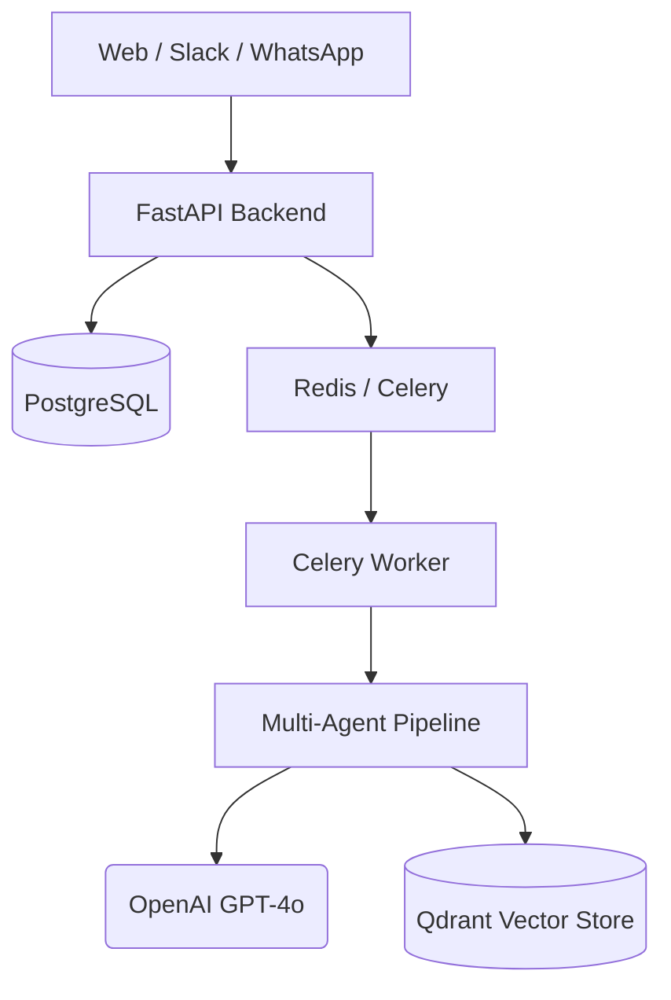

# Polis Architecture Walkthrough

Polis is an AI Operational Intelligence Assistant built with a multi-agent orchestrated pipeline.

## System Architecture

## Core Components

### 1. Multi-Agent Orchestrator
The 'Brain' of Polis is implemented using **LangGraph**. It coordinates 7 specialized agents:
- **Transcript Agent**: Cleans and segments raw discussion text.
- **Task Agent**: Extracts assignments, owners, and deadlines.
- **Contradiction Agent**: Identifies logical or operational conflicts.
- **Risk Agent**: Assesses hazards and blockers.
- **Feasibility Agent**: Evaluates the realism of plans.
- **Validator Agent**: Cross-checks findings for hallucinations and consistency.
- **Executive Summary Agent**: Synthesizes final insights for leadership.

### 2. Memory System
- **Semantic Retrieval**: Uses OpenAI embeddings stored in Qdrant to provide long-term organizational memory.
- **RAG (Retrieval Augmented Generation)**: The Chat system retrieves relevant past discussions before answering user queries.

### 3. File Processing
- **Audio Extraction**: Uses OpenAI Whisper for high-accuracy meeting transcription.
- **Document Ingestion**: Supports PDF, Word, and Text extraction with automated metadata tagging.

### 4. Communication Layer
- **Unified Interface**: Connectors for Slack and WhatsApp that translate external events into the internal intelligence pipeline.

## Technical Details
- **Backend**: FastAPI with async SQLAlchemy (PostgreSQL).
- **Frontend**: React + Tailwind CSS with premium glassmorphic UI.
- **Orchestration**: LangGraph for stateful multi-agent workflows.
- **Memory**: Qdrant Vector Database for semantic search.
- **Task Queue**: Celery with Redis for asynchronous background processing.
- **Deployment**: Full Docker Compose orchestration with Nginx reverse proxy.
